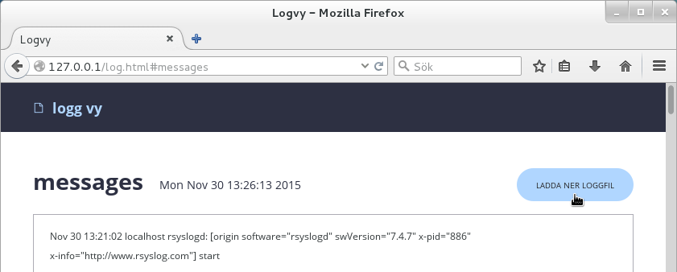
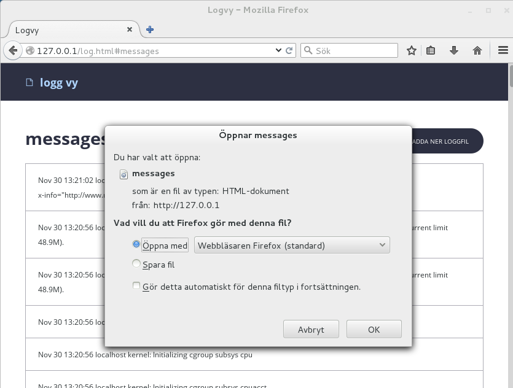

# Logginsamlingsserver

Detta kapitel beskriver en server med en särskild säkerhetsfunktion - att kunna spela in och spara inskickade loggmeddelanden som den har fått sig tillsänt via nätverket.

Servern är en för funktionen speciellt uppsatt Linuxserver som enbart fungerar som en enkel loggserver.

## Översikt

Logginsamlingsservern används för att samla in loggar från andra datorer, nätverksutrustning, SCADA-utrustning (PLC:er, RTUer, protokollomvandlare, med mera) som skickar dem över nätverket via [syslog]-protokollet. Loggar som sparas på servern kan vid senare tillfälle inspekteras via ett enkelt webbaserat gränssnitt. Det går även att göra enklare sökningar i loggarna.

## Installation av loggserver

I kapitlet [Installation] finns detaljerad information om hur en komplett installation går till.

## Användning

I första hand tar loggservern emot loggmeddelanden från annan utrustning, som via nätverket
skickar loggmeddelanden till servern.


*OBS! Notera att servern även sparar sina egna loggmeddelanden till denna loggfil. Detta bör hållas i åtanke när man letar efter innehåll i loggarna.*

### Lista loggmeddelanden och innehåll i loggfiler

En enkel funktion som man vill göra i loggservern är att kunna lista inkomna loggmeddelanden. Via webbgränssnittet går det enkelt att lista inkomna loggmeddelanden. Det gör man genom att med muspekaren välja en av filerna till vilket loggmeddelandena sparas, samt klicka på filnamnet.  
Se exemplet nedan.


En ny innehållsvy visas då. Där listas innehållet, med en rad per loggmeddelande i den valda filen. Se exemplet nedan.


### Ladda ned loggfiler

En enkel funktion som man vill göra i loggservern är att kunna ladda ned loggmeddelanden. Via webbgränssnittet går det enkelt att ladda ned loggmeddelanden. Det gör man genom att med muspekaren välja en av filerna till vilket loggmeddelandena sparas, samt klicka på filnamnet. Se exemplet nedan.


En ny innehållsvy visas då. Där listas innehållet, med en rad per loggmeddelande, i den valda filen. För att hämta filen med loggar,
klicka på knappen **LADDA NER LOGGFIL** i övre högra hörnet.




Ett nytt fönster kommer upp som frågar hur du vill hantera filen, om den ska visas direkt i webbläsaren eller om den ska
sparas till disk. Se exemplet nedan.




### Söka efter text i ett loggmeddelande

I loggservern går det också enkelt att söka efter en specifik text bland de inskickade meddelandena.

På servern med den medföljande webbläsaren går det att skriva adressen <http://127.0.0.1/log>
och via den sidan söka i de existerande loggarna direkt i webläsaren.


Själva sökfunktionen kanske inte uppfattas så användarvänlig för en ovan person. Om sökningen matchar en textsträng i ett loggmeddelande i någon av loggfilerna, kommer filnamnet att listas nedanför sökrutan. Att funktionen kan verka något oanvändarvänlig kan bland annat bero på att:

* sökningen listar filnamn, inte själva den textrad där sökningen träffar ett sökuttryck
* om det bara finns en fil, till exempel i början av användningen av en installerad server, kommer fillistningen finnas där före sökningen, och efter det att sökuttrycket skrivits klart och du tryckt på nyradsknappen, kommer listningen se likadan ut


Bakom kulisserna på själva loggservern, sker sökningen med hjälp av verktyget *[grep]*
för att kunna välja ut de loggrader som är intressanta. Detta medför att de användare som är familjära med de sökuttryck som
*grep* medger kan skriva mer avancerade söktermer.


## Detaljer

### Loggmeddelanden via nätverket

Denna server använder tjänsten [rsyslog] för att ta emot syslog-meddelanden från annan
nätverksansluten utrustning.

Servern är konfigurerad att kunna ta emot loggar som skickas via nätverket på:

* 514/UDP (klassisk syslog)
* 514/TCP (syslog över TCP, för att inte tappa paket)

För att loggmeddelanden ska tas emot av loggservern måste de servrar, kommunikationsutrustningar,
ICS-utrustningar som ska skicka nätverksloggar sättas upp för detta. På respektive loggkälla måste
serverns IP-adress (eller domännamn, om du använder dig av DNS) konfigureras som syslog-mottagare.

Hur detta görs på respektive system som ska skicka loggar kan inte beskrivas här utan detta hänvisas till dokumentationen för loggkällan.

### Filsystemsdetaljer

Alla loggmeddelanden som skickas över till loggservern sparas lokalt i filsystemet, så att
de finns undansparande i händelse av strömavbrott eller om datorn på annat sätt startas om.

Inkomna loggmeddelanden sparas vid ankomsten till servern ner i en fil som heter *messages*
och ligger i filkatalogen */var/log/*, det vill säga */var/log/messages*.

Loggfilen *roteras* och komprimeras ihop, det vill säga den sparas undan som en arkivfil, när storleken
överstiger 5MB. Loggservern är uppsatt med en konfiguration för att rotera loggfiler upp till
10000 gånger innan den äldsta arkiverade filen raderas. Dessa inställningsvärden är valda
för att fungera väl med att en användare enkelt ska kunna ladda ner en fil i webbläsaren om
man har gjort en sökning och funnit att en loggfil matchar ett visst sökutryck.

Om loggservern installeras i en miljö där det är mycket aktivitet, och det skickas mycket
loggmeddelanden till loggservern, kanske inte ovanstående inställningar i loggservern
är så väl anpassade. På samma sätt kan det uppstå en krock mellan olika kravställningar
om det finns behov eller specifika krav på att spara loggar länge. Då kan det behövas
en annan typ av arkivering och gallring av loggar behöva sättas
upp. I dessa fall måste en mer anpassad loggkonfiguration, som är i enlighet med den policy
eller det regelverk som gäller, tas fram och sättas in på loggservern.

### Säkerhet
Säkerhetsmekanismen [SELinux] används för att få en bättre system- och applikationssäkerhet på
denna loggserver genom att låsa ner själva systeminställningarna och dess viktiga
komponenter och hur de interagerar med systemet och systemets resurser (filsystem, programexekvering, med mera) på servern.

En enkel webbserver av typen [Apache], är startad. Som standard lyssnar den inte ut mot nätverket, så den kan inte
nås via fjärråtkomst mot webbtjänsten.  Webbservern är vid standardinstallation enbart åtkomlig från det egna systemet
och därmed från en webbläsare som man kör inloggad på konsolen och skrivbordet. Apache är uppsatt så den dessutom är
nedlåst med *SELinux* på ett speciellt sätt, så att den enbart ska kunna läsa i katalogen **/var/log/** där loggfilerna ligger.

## Avancerad användning

Att samla in loggar och göra logganalys kan vara svårt med denna förhållandevis enkla logginsamlingsservern. Det finns mer avancerade
system för logginsamling om ett aktivt arbete med loggar och säkerhet behövs. Några exempel på mer avancerade
loggserverfunktioner är [greylog], [elk] och [splunk] för att implementera [SIEM], [SEM] eller [SIM]-lösningar.

Det finns en potentiell möjlighet att denna tjänst kan bli mål för s.k. DOS-attacker genom att någon skickar väldigt mycket loggar till tjänsten som inte är korrekta. För att undvika detta kan tjänsten begränsas genom åtkomstkontroll i en brandvägg. Det bör även övervakas så inte loggar fyller disken.

### Krypterade syslogmeddelanden
För att få bättre säkerhet kan TLS användas för transporten.

Det går att i stället för klassisk syslog även skicka loggmeddelanden krypterat. Standarderna för detta gäller för:

* 6514/UDP
* 6514/TCP

UDP-varianten innebär att syslog skickas över en krypterad DTLS-tunnel, medans TCP-baserad syslog skickas över en krypterad TLS-tunnel.

Syslogservern är inte konfigurerad för att aktivera detta som standard. Det går dock att ställa in servern för detta. Ett steg är
att ändra i brandväggsreglerna lokalt på servern genom att editera i **/etc/sysconfig/iptables** för att tillåta inkommande trafik på dessa portar. Regler för att öppna i brandväggen för dessa portar kan se ut enligt nedan:

```
-A INPUT -m state --state NEW -p tcp --dport 6514 -j ACCEPT
-A INPUT -m state --state NEW -p udp --dport 6514 -j ACCEPT
```

För att skapa elektroniska certifikat för servern, och aktivera rsyslog med mera krävs dock mer arbete. Här finns en engelskspråkig guide där det beskrivs hur man gör:
<http://www.rsyslog.com/doc/master/tutorials/tls.html>.

EN annan teknik för att begränsa vilka som får skicka loggar till logservern är att konfigurera vilka IP-adresser som får skicka loggar till logservern. En exempelregel kan se ut enligt följande, där IP-adress 10.255.255.12 tillåts att skicka loggar över TCP till servern.

```
-A INPUT -s 10.255.255.12 -m state --state NEW -p tcp --dport 514 -j ACCEPT
```

### Extern åtkomst till webben

Om det finns behov av att kunna nå nätverksinspelningsservern från en annan dator måste
konfigurationen för webbservern ändras så att den även är åtkomlig på det externa nätverksgränssnittet.
Då måste kryptering och autentisering aktiveras så att den potentiellt känsliga informationen inte kan ses
av någon obehörig.

Efter att autentisering kryptering lagts till webbservern enligt dokumentation från Apache, behöver även brandväggskonfigurationen justeras.
Öppna en *Terminal* och ändra i filen */etc/sysconfig/iptables*.
Därefter måste du ladda om brandväggsreglerna med kommandot

```
	sudo iptables-restore /etc/sysconfig/iptables
```
Läs kapitlet [Terminal-åtkomst och kommandoraden] om du behöver hjälp med hur man arbetar via terminalen eller hur man ger kommandon på kommandoraden.

\clearpage
