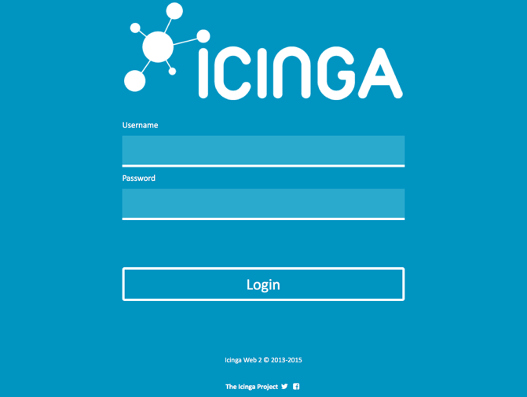
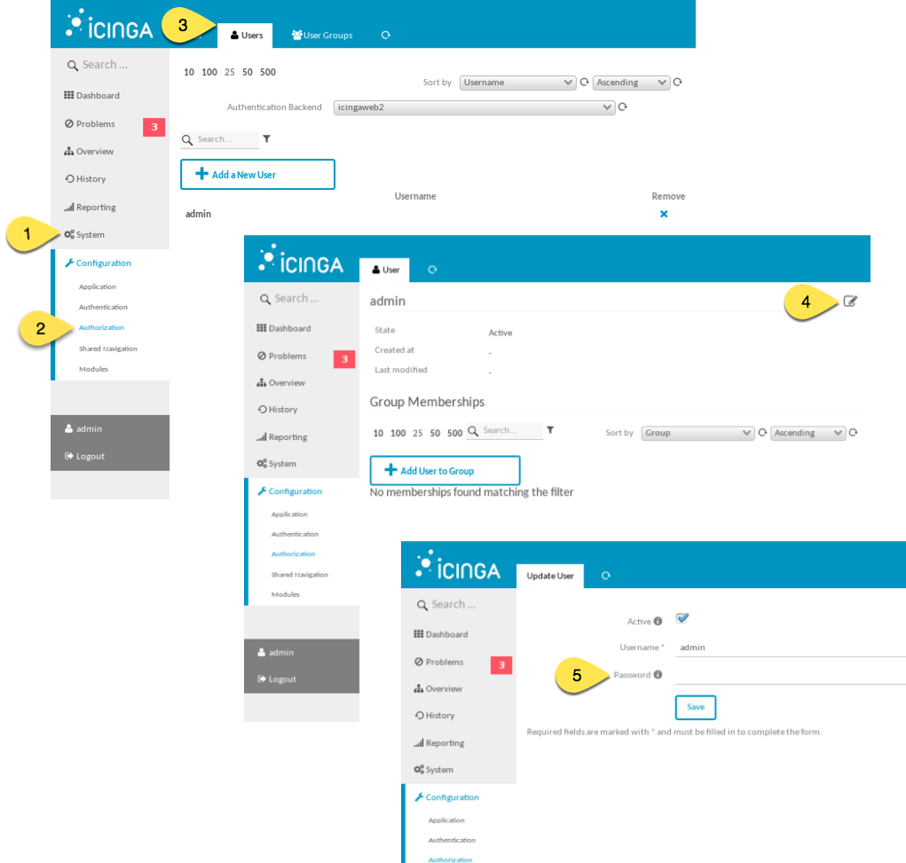

# Övervakningsserver för att monitorera datorer och tjänster

## Översikt

Övervakningsservern kan användas för att samla in driftinformation från tjänster och servrar. Det sker genom att olika typer av anslutningar görs mot den aktuella tjänsten som övervakas, exempelvis så kan [ping] användas. Verktyget [icinga] används för att monitorera alla tjänster som är konfigurerade att bli övervakade, resultatet visualiseras i ett webbaserat modernt gränssnitt.

Om en tjänst eller server inte är åtkomlig för Icinga visas det visuellt i gränssnittet.
Det går även att få notifikationer via exempelvis e-post och/eller sms när en tjänst eller server inte är åtkomlig för Icinga.

I den paketerade lösningen finns det ett skapat exempelskript för att skicka sms till en SMS Gateway.

Vid denna installation kommer ett slumpmässigt lösenord att genereras för inloggning till webbtjänsten. Detta lösenord blir även hårdkodat i dokumentionen som finns på servern efter installation. Detta lösenord bör ändras och den genereade dokumentationen som finns på serven ska inte delas. Om dokumentationen ska användas utanför servern kan den laddas ner från samma ställe som installationsmediet.

## Användning

På den server där övervakningstjänsten är installerad går det att med en webbläsare på <http://127.0.0.1/icingaweb2> logga in och se aktuell status av de tjänster och datorer som övervakas enligt de regelverk som är konfigurerade.  



Installationen kräver dock ytterligare konfiguration innan tjänster och servrar kan övervakas med Icinga. Själva Icinga-servern är förkonfigurerad att övervaka sig själv direkt efter installationen.

## Detaljer

### Säkerhet

Icinga-projektet har ännu inte färdigutvecklat stöd för [SELinux].
Därför så följer det med en enkel SELinux-profil i denna installation.
Denna SELinux-policy är satt för att ge bättre säkerhet i systemet.
Den medföljande profilen kan behöva modifieras för vissa typer av ändamål
än det som installationen är testad för, till exempel mer avancerade övervakningsagenter.

Icinga använder en databasmotor för lagring av information.
Den databasmotor som är installerad heter [PostgreSQL].

Det finns två stycken databaser konfigurerade i den:

* En för Icingas övervakning.
* En för det webbaserade gränssittet, som är en separat programvara skild från själva övervakningsdelen.

De två databaserna har slumpmässigt satta lösenord som Icinga och webbgränssnittet använder för åtkomst till databasen. Lösenorden för just databasåtkomst är därmed unika för den aktuella installationen.

För att logga in i webbgränssnittet används det förkonfigurerade användarkontot:  

```
    admin
```

Med lösenordet:  

```
    p_slumptal_p
```

*Efter första inloggningen rekommenderas det starkt att byta ut lösenordet till ett nytt starkt lösenord. Lösenordsbytet kan ske i webbgränssnittet enligt följande:*

  

1. Klicka på **System**.
2. Klicka på **Authorization**.
3. Klicka på **Users**.
4. Klicka på **Editera-ikonen**.
5. Skriv in det nya säkra lösenordet och välj spara.


### Webbservern Apache

Webbservern som används heter Apache, det är den webbserver som Icinga har bäst stöd för. Apache är dessutom en bra webbserver som anses vara väldigt säker. Själva koden för det grafiska gränssnittet bygger på PHP vilket är ett programmeringsspråk som har haft väldigt många säkerhetsrelaterade problem under många år. Därför bör man inte exponera det grafiska gränssnittet till andra än betrodda och då med stark kryptering över [TLS] eller tunnlat med SSH.

### Konfiguration

Efter installationen av servern är Icinga och det webbaserade administrationsgränssnittet färdigkonfigurerade och Icinga övervakar datorn där den är installerad. För att övervaka andra maskiner och för att få notifikationer behövs ytterligare konfiguration som är specifik för den aktuella miljön som ska övervakas.
Icinga har fullständig dokumentation på <http://docs.icinga.org/icinga2/latest/doc/module/icinga2/toc>. Här beskrivs samtliga funktionaliteter för att anpassa övervakningen till den miljö som behöver övervakas. Dokumentationen finns för närvarande enbart på engelska.

### Anpassa konfigurationsfiler till målmiljön
Icinga kan konfigureras med en texteditor i en terminal. Terminalen startas i applikationsmenyn i det vänstra övre hörnet. Programmet "Terminal" finns i undermenyn "Utilities".
Ytterliggare information om hur terminalen används och hur filer kan editeras finns i kapitlet [Terminal-åtkomst och kommandoraden].

För att editera konfigurationsfilerna behövs högre rättigheter i systemet än vad användarkontot i det grafiska gränssnittet har som standard. Det går att få dessa hägre rättigheterna i terminalen genom att skriva kommandot "sudo su". Med de högre rättigheterna så kan allt i systemet påverkas så var extra försiktig innan någon fil ändras.  
Själva konfigurationen av Icinga finns i katalogen */etc/icinga2* som går att komma till med kommandot ***cd /etc/icinga2***.
Konfigurationen görs i textfiler och de flesta av konfigurationsfilerna finns i katalogen */etc/icinga2/conf.d*.

### Lägga till maskiner för övervakning
Ändra i filen */etc/icinga2/conf.d/host.conf* för att lägga till eller ta bort övervakningsfunktioner.
Om du lägger till följande:  

```
    object Host "valfritt_namn" {
        import "generic-host"
        address = "ipnummer"
        vars.http_vhost["http"] = {
        http_uri = "/"
      }
      vars.http_ssl = true
    }
```

så kommer programmet kontrollera att maskinen med IP-numret (*IP-nummer* ska vara ett korrekt ip-nummer) är nåbar med *ping* och om den har en åtkomlig webbserver som använder SSL/TLS.  
Så här är kommandot uppbyggt:  

* ***import "generic-host"*** importerar en mall från filen "/etc/icinga2/conf.d/templates.conf" som gör ping-försök mot den konfigurerade servern.  
* ***address*** är själva ip-adressen till maskinen som ska övervakas  
* ***vars.http_vhost...*** gör så att anslutningsförsök sker mot maskinens webbserver  
* ***vars.http_ssl = true*** säger att anslutningsförsök till webbservern ska ske med *SSL/TLS*.

Det går att lägga till fler typer av övervakningsmetoder. Exempelvis kan SNMP användas för att hämta information från ett system.
Det går att lägga till flera så kallade *object* i filen så att fler maskiner kan övervakas.

Efter att ändringar gjorts i konfigurationsfilen måste icinga startas om för att ändringarna ska börja fungera. Öppna ett terminalfönster (för information om hur man kör kommandon och använder terminalfönstret, se [Terminal-åtkomst och kommandoraden]), och kör kommandot:

```
	sudo systemctl restart icinga2
```

### Lägga till sms-notifikationer

En vanlig metod för att få larm från övervakningssystem är att skicka larmen via sms-meddelanden till en övervakningsansvarigs mobiltelefon.

Installationen är förkonfigurerad för att göra det enklare att få notifikation med sms. Det följer med ett script/program för integration mot [Beepsend] som är en av flera möjliga leverantörer för sms-tjänster. Det är även möjligt att ansluta ett GSM-modem direkt till servern och skicka alla sms via det. Ett lokalt modem är den bästa lösningen om monitoreringsservern är placerad i en miljö utan kommunikationsmöjligheter till Internet.  
För att få notifikationer via sms måste filen */etc/icinga2/conf.d/users.conf* modifieras. Om enbart det fördefinierade användarkontot **icingaadmin** används så ska variabeln *pager* skrivas in på en ny rad i objektet som är inom måsvingarna({}), exempelvis:

```
    pager = "nummer"  
```
där *nummer* är ett korrekt mottagarnummer inklusive landskod.  

Dessutom ska den regel som får trigga en notifikation konfigureras ytterligare enligt följande:  

```
    vars.notification["pager"] = {
        groups = [ "icingaadmins" ]
    }
```

Genom denna konfiguration kommer alla användare med nummer konfigurerat under variabeln *pager* i */etc/icinga2/conf.d/hosts.conf* få en notifikation via sms om objektet som övervakas inte är åtkomligt.

Programmet som skickar sms måste också konfigureras med kontouppgifter från den leverantör som är vald om sms inte skickas med ett lokalt anslutet modem. Ifall det fördefinierade skriptet för Beepsend används måste tre variabler sättas till korrekta värden i skriptet */etc/icinga2/scripts/beepsend.pl*.  

* from-variabeln sätts till avsändarnummer eller alfanumeriskt nummer,  
exempelvis: **my $from = '123456789'**  

* beepConnection-variabeln sätts till den kundspecifika anslutning som ska användas,  
exempelvis: **my $beepConnection = 'company_ab'**  

* beepToken variabeln sätts till den token (lösenord/nyckel) som erhålls av beepsend,  
exempelvis: **my $beepToken = '1234567890abcdef1234567890abcdef1234567890abcdef'**

Efter att ändringar gjorts i konfigurationsfilen måste icinga startas om för att ändringarna ska börja fungera. Öppna ett terminalfönster (för information om hur man kör kommandon och använder terminalfönstret, se [Terminal-åtkomst och kommandoraden]), och kör kommandot:

```
    sudo systemctl restart icinga2
```

## Avancerat, nästa steg

Icinga har stöd för flera övervakningsservrar som kan integrera med varandra och övervaka olika delar i ett nätverk, det medför att lösningen lämpar sig bra i en segmenterad nätverksmiljö som är byggt enligt exempelvis en *zonmodell* med tydliga separationer där kommunikation mellan olika zoner eller zoninstanser är *kontrollerade*. Det går att konfigurera flera så kallade *satelliter* i olika zoner för att inte behöva bygga ett platt övervakningsnätverk där en övervakningsserver tillåts kommunicera med alla servrar i ett större nätverk. Med satelliter går det att enbart tillåta kommunikation mellan satelliter och den centrala Icingaservern och låta en satellit övervaka en zon eller zoninstans.

### Extern åtkomst till övervakningsgränssnittet

Installationen är konfigurerad för att enbart tillåta åtkomst till webbadministrationsgränssnittet från den lokala datorn där Icinga är installerad. För att få åtkomst till gränssnittet från en annan dator kan antingen lokala eller centrala användarkonton konfigureras i linuxservern och SSH installeras för att ge dessa användare möjlighet att tunnla webbgränssnittet över SSH-protokollet.

Det går även att konfigurera Apache med TLS och autentisering för ge extern direktåtkomst till webbgränssnittet.  

För extern åtkomst behöver även brandväggen justeras för att tillåta externa att nå tjänster. Öppna en
*Terminal* och kommentera ut raden med hänvisning till *HTTPS* eller *SSH* i
**/etc/sysconfig/iptables** med högre rättigheter och ladda sedan om brandväggsreglerna med kommandot:  
```
    sudo iptables-restore /etc/sysconfig/iptables***
```

\clearpage
